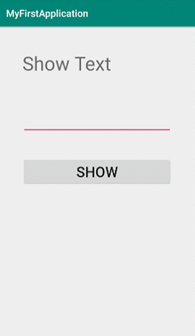
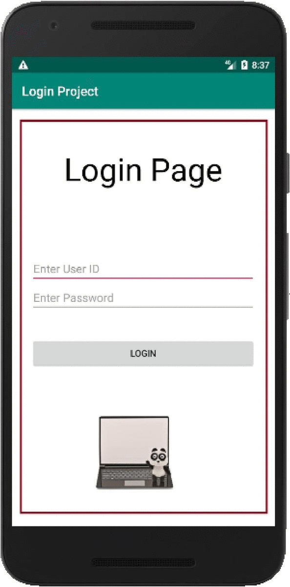

## Android
### Display Text On Button Click   
   

### Layout Assignment
Use the following Layout Designs (**`Relative Layout, Table Layout, Frame Layout, Absolute Layout`**) and create a small individual project in which there will be 4 or 5 Activities connected with each other by buttons or any other widget of your choice. In each activity use one of the following layout designs to show text or image or anything of your choice.  

https://user-images.githubusercontent.com/39675078/132578745-6c19365a-4add-4a8e-a901-8f382dcfc0c1.mp4

###  Android Login Activity
  
